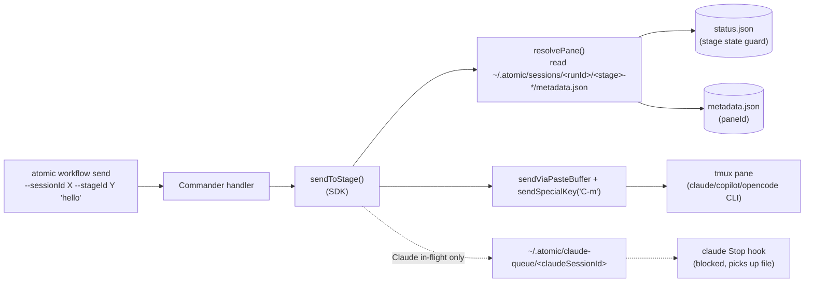

# `atomic workflow send` — Inject a Message into a Live Workflow Stage

| Document Metadata      | Details                                                  |
| ---------------------- | -------------------------------------------------------- |
| Author(s)              | Norin Lavaee                                             |
| Status                 | In Review (RFC) — open questions resolved 2026-05-07     |
| Team / Owner           | Atomic CLI                                               |
| Created / Last Updated | 2026-05-07                                               |

## 1. Executive Summary

Add `atomic workflow send --sessionId <session> --stageId <stage> <message>` to deliver a free-text prompt into a running stage's agent pane without leaving atomic. Today, an external tool that wants to nudge a live workflow (e.g. "answer the AskUserQuestion", "follow up on the previous turn", "supply additional context mid-run") has to attach via tmux and type by hand, or shell out to `tmux send-keys` directly, both of which leak the pane-id resolution outward. The send-keys / paste-buffer primitives already exist inside the SDK (`runtime/tmux.ts:346–388`), and per-stage `paneId` is already persisted to `~/.atomic/sessions/<runId>/<stage>-<id>/metadata.json` (`runtime/executor.ts:1931–1947`). This RFC wires those primitives into a first-class CLI command and a matching SDK primitive so agents and humans both use one path.

## 2. Context and Motivation

### 2.1 Current State

- The orchestrator process owns an in-memory `shared.activeRegistry: Map<string, ActiveSession>` (`runtime/executor.ts:1336`) mapping stage name → `{name, paneId, done}`. This map is **not** reachable from outside the orchestrator process.
- The on-disk projection lives at `~/.atomic/sessions/<workflowRunId>/<stage>-<sessionId>/metadata.json`, which records `{ name, description, agent, paneId, serverUrl, port, startedAt }` (`runtime/executor.ts:1931`).
- `runtime/tmux.ts` exports three already-usable send primitives:
  - `sendLiteralText(paneId, text)` — `send-keys -l --` (line 346)
  - `sendViaPasteBuffer(paneId, text)` — atomic delivery via `load-buffer` + `paste-buffer -d` (line 363)
  - `sendSpecialKey(paneId, key)` — `send-keys` without `-l` for `C-m`, `C-c`, etc. (line 387)
- `runtime/status-writer.ts` snapshots per-stage status to `<runId>/status.json` (`workflowRunIdFromTmuxName` extracts the run id from a tmux session name, line 193).
- The `atomic workflow status` command already demonstrates the disk-first / tmux-fallback pattern this command will mirror (`commands/cli/workflow-status.ts`).

### 2.2 The Problem

- **No public way to push a message into a running stage from outside the orchestrator.** Consumers either resort to `tmux -L atomic send-keys ...` (leaking implementation details) or write-then-read on the Claude queue dir (private to providers/claude.ts).
- **Composition gap.** Sibling commands (`workflow status`, `workflow inputs`, `workflow refresh`) make atomic feel scriptable, but the moment an agent wants to *react* to status it can only attach interactively. `send` closes the loop.
- **Provider-asymmetric write paths.** OpenCode and Copilot can take tmux keystrokes; Claude follow-up prompts are routed through `~/.atomic/claude-queue/<claudeSessionId>` + Stop hook (`providers/claude.ts:761`). Today the queue mechanism is not callable from outside the orchestrator because `claudeSessionId` is held only in `initializedPanes` (`providers/claude.ts:65`). This RFC must decide whether to persist it.

## 3. Goals and Non-Goals

### 3.1 Functional Goals

- [ ] `atomic workflow send --sessionId <tmux-session> --stageId <stage> <message...>` resolves the pane and delivers `<message>` into the stage's agent.
- [ ] The default behavior auto-submits the message (presses `Enter` / `C-m` after pasting), so the call mirrors "type then enter" UX.
- [ ] JSON output by default (matching `workflow status`) so agents can consume `{ delivered: true, sessionId, stageId, paneId }`.
- [ ] Exit code `0` on successful delivery; `1` on validation/lookup failure; `2` on a pre-send guard violation (e.g. stage is in terminal state).
- [ ] Wrap the resolution + send logic in a new `sendToStage()` SDK primitive in `packages/atomic-sdk/src/primitives/sessions.ts`, exported via the SDK barrel. The CLI command is a thin Commander wrapper.

### 3.2 Non-Goals (Out of Scope)

- [ ] Streaming or watching the stage's response. Use `atomic workflow status` / `atomic session connect` for that.
- [ ] Multi-stage broadcast (one message → many stages in one call).
- [ ] Sending into chat sessions (`atomic chat ...`). Chat already supports follow-up via standard tmux attach; this command is workflow-scoped.
- [ ] Mutating workflow inputs (`ctx.inputs.*`). Inputs are immutable for the duration of a run by design.
- [ ] Scheduling / queueing the message for after a stage finishes.

## 4. Proposed Solution (High-Level Design)

### 4.1 System Architecture Diagram



### 4.2 Architectural Pattern

- **Adapter on top of existing primitives.** `sendToStage()` is the adapter that hides whether a stage's write channel is tmux keystrokes or a queue file. The CLI is just a thin command surface over the adapter — same pattern as `workflow-status.ts`.
- **Disk-first resolution with tmux liveness fallback.** Mirror the precedent set by `workflow status`: read `status.json` and `<stage>/metadata.json` first; fall back to a tmux liveness check before declaring the target unreachable.

### 4.3 Key Components

| Component                                       | Responsibility                                                                                       | Location                                                            |
| ----------------------------------------------- | ---------------------------------------------------------------------------------------------------- | ------------------------------------------------------------------- |
| `sendToStage()` SDK primitive                    | Resolve `(sessionId, stageId)` → `paneId`, validate stage state, deliver message.                    | `packages/atomic-sdk/src/primitives/sessions.ts` (new export)        |
| `resolveStagePane()` helper                      | Walk `<runId>/<stage>-*/metadata.json` and pick the matching stage. Disambiguate name collisions.    | `packages/atomic-sdk/src/primitives/sessions.ts` (internal helper)   |
| `workflow-send.ts` CLI command                   | Commander wrapper; format JSON / text output; map errors to exit codes.                              | `packages/atomic/src/commands/cli/workflow-send.ts` (new file)       |
| Wire-up in CLI tree                             | Mount as `atomic workflow send` subcommand alongside `list`, `inputs`, `status`, `refresh`.          | `packages/atomic/src/cli.ts` (add a block next to lines 230–249)     |

## 5. Detailed Design

### 5.1 CLI Surface

```text
atomic workflow send --sessionId <session> --stageId <stage> [options] <message...>
```

Options:

| Flag                          | Required | Description                                                                              |
| ----------------------------- | -------- | ---------------------------------------------------------------------------------------- |
| `--sessionId, -s <id>`        | yes      | Tmux session name, e.g. `atomic-wf-claude-ralph-53c03962`. Same id used by `workflow status`. |
| `--stageId, -t <stage>`       | yes      | Stage NAME as declared in `ctx.stage({ name })`, e.g. `planner-1`. Mirrored in `status.json`'s `sessions[].name`. |
| `--message <text>`            | no       | Alternative to positional `<message...>`. Useful when message starts with `-`.            |
| `--message-file <path>`       | no       | Read message body from a file. Supersedes positional / `--message`.                       |
| `--format <json\|text>`       | no       | Output format. JSON when invoked under `ATOMIC_AGENT=1`, text otherwise.                 |
| `<message...>`                | no       | Positional; joined by single spaces. Must be present unless `--message` / `--message-file` is. |

Examples:

```bash
atomic workflow send -s atomic-wf-claude-ralph-53c03962 -t planner-1 "answer 'yes' and continue"
atomic workflow send -s atomic-wf-... -t reviewer --message-file follow-up.md --no-submit
```

### 5.2 SDK Surface

```ts
// packages/atomic-sdk/src/primitives/sessions.ts

/** Result returned by sendToStage on a successful delivery. */
export interface SendToStageResult {
  sessionId: string;
  stageId: string;
  paneId: string;
  bytesSent: number;
  channel: "tmux" | "opencode-sdk" | "copilot-sdk";
}

/** Options accepted by sendToStage. */
export interface SendToStageOptions {
  sessionId: string;             // tmux session name
  stageId: string;               // stage name
  message: string;
  deps?: SessionPrimitiveDeps;   // existing dep-injection seam, extended
}

export async function sendToStage(
  opts: SendToStageOptions,
): Promise<SendToStageResult>;
```

Errors thrown (mapped to exit codes by the CLI):

| Error class                  | Cause                                                               | Exit code |
| ---------------------------- | ------------------------------------------------------------------- | --------- |
| `MissingDependencyError`     | tmux not installed.                                                 | 1         |
| `SessionNotFoundError`       | `sessionId` not on the atomic socket.                               | 1         |
| `StageNotFoundError` (new)   | No `<stage>-*/metadata.json` matches `stageId` under the run dir.   | 1         |
| `StageNotReadyError` (new)   | Stage status is `done` / `errored`, or `paneId` no longer alive.    | 2         |
| `EmptyMessageError` (new)    | Message resolved to empty string after trimming.                    | 1         |

### 5.3 Resolution Algorithm

Given `(sessionId, stageId)`:

1. Validate `sessionId` is on the atomic tmux socket via `listSessions()`. If not → `SessionNotFoundError`.
2. `runId = workflowRunIdFromTmuxName(sessionId)`. If `null` → `SessionNotFoundError`.
3. Read `~/.atomic/sessions/<runId>/status.json` (best effort). Use it to gate stage state: skip stages with `status === "done" | "errored"` unless an explicit `--force` is passed (see Open Questions §9).
4. List subdirectories of `~/.atomic/sessions/<runId>/` matching `<stageId>-<8hex>/`. If exactly one match → use it. If zero → `StageNotFoundError`. If multiple — error out and instruct the user to disambiguate by passing the full directory id (`<stageId>-<8hex>`). In practice this collision should be impossible because `executor.ts` enforces uniqueness within a run, but the spec covers it defensively.
5. Read `<stage>/metadata.json`, extract `paneId`.
6. If `paneId` starts with `headless-` → `StageNotReadyError("stage is headless; tmux send-keys is not applicable")`. (Headless stages run in-process and have no tmux pane.)
7. Verify the pane is still alive via `tmux display-message -t <paneId>` (a tmux primitive `paneExists()` we will add to `runtime/tmux.ts` if not already there).

### 5.4 Delivery Algorithm

Routing per agent (decided 2026-05-07):

- **OpenCode**: read `serverUrl` from `<stage>/metadata.json`, instantiate `createOpencodeClient({ baseUrl: serverUrl })`, deliver via the OpenCode SDK's prompt method against the currently selected session. Mirrors how the orchestrator drove OpenCode at `runtime/executor.ts:1525–1530`. No tmux keystrokes.
- **Copilot**: read `serverUrl` from `<stage>/metadata.json`, instantiate `new CopilotClient({ cliUrl: serverUrl })`, `client.start()`, deliver via the SDK against the foreground session id set at `runtime/executor.ts:1495`. No tmux keystrokes.
- **Claude**: tmux paste-buffer path. `sendViaPasteBuffer(paneId, message)` followed unconditionally by `sendSpecialKey(paneId, "C-m")`. Constraint: Claude must be idle / at the input box — mid-stream Claude injection is out of scope for Phase 1 because `claudeSessionId` is not persisted to `metadata.json` (see Phase 2 in §8.1).

Submission is always implicit — there is no `--no-submit` escape hatch. Every send is a complete prompt; callers compose the full message client-side before invoking the command.

Sub-tasks discovered while wiring SDK paths:

1. **Persist provider session id where the SDK requires it.** OpenCode's `client.session.prompt({ sessionID })` and the Copilot equivalent both want the SDK-side session id. Today only `paneId` and `serverUrl` land in `<stage>/metadata.json`; we extend the schema with an optional `providerSessionId` written by the executor at session creation. Readers must tolerate its absence (back-compat: existing on-disk runs would otherwise need a fallback to "the foreground / selected session" RPC, which both SDKs expose).
2. **Headless stages** still have no `serverUrl` — they run in-process to the orchestrator. They remain unsupported (see Q9).

### 5.5 Output Schemas

JSON success:

```json
{
  "delivered": true,
  "sessionId": "atomic-wf-claude-ralph-53c03962",
  "stageId": "planner-1",
  "paneId": "%157",
  "bytesSent": 42,
  "submitted": true,
  "channel": "tmux"
}
```

JSON error:

```json
{ "delivered": false, "error": "Stage 'planner-1' is in terminal state 'errored'." }
```

Text success: `delivered → planner-1 (%157, 42 bytes, submitted)`.

### 5.6 Format default

Match `workflow status` precedent: default JSON when `ATOMIC_AGENT=1` is set (the LM is the consumer), text otherwise. The `--format` flag overrides.

## 6. Alternatives Considered

| Option                                                         | Pros                                              | Cons                                                                  | Reason for Rejection                                                                                          |
| -------------------------------------------------------------- | ------------------------------------------------- | --------------------------------------------------------------------- | ------------------------------------------------------------------------------------------------------------- |
| A: Document `tmux -L atomic send-keys ...`                     | Zero new code.                                    | Leaks pane-id resolution onto the user; agent has to scrape `metadata.json` itself; broken for Claude. | Defeats the point of having an SDK.                                                                            |
| B: New IPC channel into the orchestrator process                | Avoids reading disk; supports rich operations.    | Major architectural change; the orchestrator is currently filesystem-mediated everywhere else (status, transcripts). | Out of proportion to the value. Reuses one new file, breaks symmetry with `workflow status`.                  |
| C: Thin CLI wrapper over `runtime/tmux` send primitives (Selected) | Reuses existing primitives; mirrors `workflow status` shape; small surface area. | Doesn't fully solve Claude in-flight injection without persisting `claudeSessionId`.                          | **Selected**: smallest change for the highest payoff. Claude in-flight handling is a clean Phase 2.            |
| D: Always require `--<stage>-<8hex>` directory id              | Fully unambiguous.                                | Hostile to users; nobody knows the 8-hex without scraping disk.       | Stage names are unique within a run already; defensive fallback covers the collision case.                    |

## 7. Cross-Cutting Concerns

### 7.1 Security and Privacy

- **Trust boundary**: the command is local-only and reads/writes files under `~/.atomic`. No new network surface.
- **Message confidentiality**: when using `sendViaPasteBuffer`, the message is briefly persisted to a tmp file (`atomicTempPath("atomic-paste", ".txt", ...)`, `runtime/tmux.ts:365`) before being unlinked in a `finally`. This already mirrors how all paste-buffer sends behave inside the orchestrator.
- **Prompt-injection risk**: a caller can inject arbitrary text into the agent. This is the explicit goal of the command, equivalent to typing in the pane. No mitigation is owed.
- **No `tmux send-keys` literal-interpretation foot-guns**: by default we use paste-buffer (treats text as data), not literal text mode, so `C-m` / `Tab` strings inside the message do not get interpreted as keystrokes. `--no-submit` + the explicit `sendSpecialKey("C-m")` is the only key-interpretation path and is gated by an explicit flag default.

### 7.2 Observability Strategy

- **Logging**: when `ATOMIC_DEBUG=1` is set, write a single stderr line `[atomic/workflow-send] sessionId=... stageId=... paneId=... bytes=... submitted=...` after delivery. Mirrors the existing `[atomic/workflow]` debug line in `commands/cli/workflow.ts:421`.
- **No metrics or tracing** — local CLI, single shot, no service.

### 7.3 Scalability and Capacity Planning

- Single-shot CLI, no scaling considerations. Worst-case payload size bounded by the agent CLI's own input box length; tmux paste-buffer has no practical ceiling for our messages.

## 8. Migration, Rollout, and Testing

### 8.1 Deployment Strategy

- **Phase 1**: ship CLI + SDK primitive scoped to OpenCode + Copilot + Claude-when-idle (tmux paste-buffer path). No persisted `claudeSessionId`; document that Claude in-flight injection requires the user to wait for the input box.
- **Phase 2**: persist `claudeSessionId` to `<stage>/metadata.json` and route Claude through `enqueuePrompt()` automatically when the stage is mid-stream. Adds a new `channel: "claude-queue"` value to the result.

### 8.2 Data Migration Plan

- None. `metadata.json` already contains everything needed for Phase 1. Phase 2 adds an optional `claudeSessionId` field; readers tolerate its absence.

### 8.3 Test Plan

- **Unit (atomic-sdk)**: `sendToStage` with a mocked `SessionPrimitiveDeps`; cover happy path, missing session, missing stage, headless stage, terminal-state stage, multiple-match disambiguation.
- **Unit (atomic CLI)**: `workflow-send.test.ts` exercises Commander parsing, `--message-file`, `--no-submit`, JSON vs text output, exit codes for each error class. Use the existing dependency-injection seam shown in `workflow-status.test.ts`.
- **Integration**: spawn a real `atomic workflow -n ralph -a opencode "..."` session (already covered by `workflow.test.ts` patterns), call `atomic workflow send` against it, capture the pane and assert the message is visible.
- **Cross-platform**: the runtime-assets smoke harness already validates tmux subprocess plumbing; no new matrix work needed for Phase 1.

## 9. Open Questions / Unresolved Issues

- [x] **Q1 — `--stageId` semantics**: **Resolved 2026-05-07** — stage name only (e.g. `planner-1`). Defensive disambiguation hint when collision detected, but uniqueness is enforced upstream.
- [x] **Q2 — Per-agent delivery channel**: **Resolved 2026-05-07** — OpenCode and Copilot via their SDKs (using the persisted `serverUrl`), Claude via tmux paste-buffer. Mid-stream Claude injection is Phase 2.
- [x] **Q3 — Submit behaviour default**: **Resolved 2026-05-07** — always submit unconditionally; no `--submit` / `--no-submit` flag. Callers compose the full message before invoking.
- [x] **Q4 — Pre-send guard severity**: **Resolved 2026-05-07** — hard error with exit 2 when stage status is terminal (`done` / `errored`).
- [x] **Q5 — Message input channels**: **Resolved 2026-05-07** — positional `<message...>` plus `--message-file <path>` for long inputs. No stdin piping in Phase 1.
- [x] **Q6 — Output format default**: **Resolved 2026-05-07** — match `workflow status` precedent: JSON when `ATOMIC_AGENT=1`, text otherwise; `--format` overrides.
- [x] **Q7 — Multi-stage broadcast**: **Resolved 2026-05-07** — single-stage only. Callers loop in shell if they want fan-out.
- [x] **Q8 — SDK exposure**: **Resolved 2026-05-07** — public primitive in `primitives/sessions.ts`, re-exported via the SDK barrel; CLI command is a thin Commander wrapper.
- [x] **Q9 — Headless stage handling**: **Resolved 2026-05-07** — hard-error with `StageNotReadyError("stage is headless; send is not supported for in-process stages")`. File-based delivery for headless stages can be a Phase N follow-up if a use case emerges.
- [x] **Q10 — Force flag**: **Resolved 2026-05-07** — no `--force` in Phase 1.
